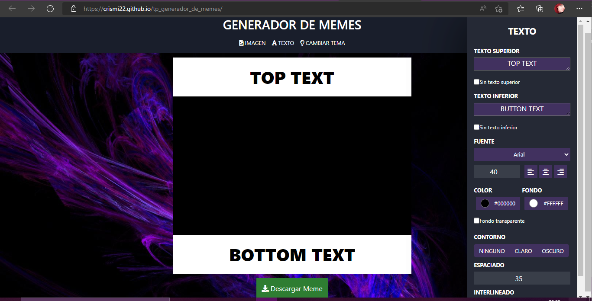
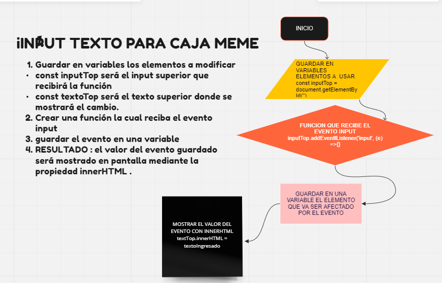

## GENERADOR DE MEMES.
### TRABAJO PRACTICO REALIZADO CON HTML5, CSS3 Y JAVASCRIPT

* La página está diseñada para que puedas pegar el link de una imagen que mas te guste desde la web y editarla desde acá.
* Tiene un diseño que se adapta a diferentes dispositivos.
* Con el boton **CAMBIAR TEMA** se puede cambiar al tema claro si lo deseas.
* Podes guardar la imagen editada con el botón **DESCARGAR MEME**.
* Dale un vistazo desde acá y generá tu propio meme: 
[Genedaror de meme](https://crismi22.github.io/tp_generador_de_memes/)

> Un gran poder conlleva una gran responsabilidad - Tio Ben

_Espero que les guste mi página, esta creada con mucho esfuerzo y horas silla :)_
### Pseudocodigo de input texto TOP TEXT

README HECHO CON [Markdown](https://www.markdownguide.org/cheat-sheet/)
